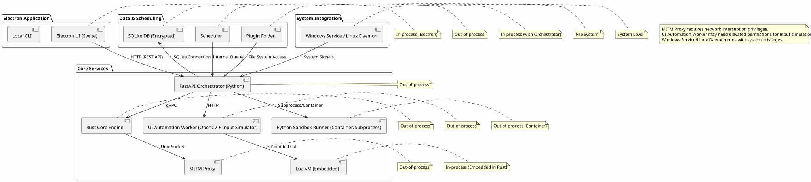
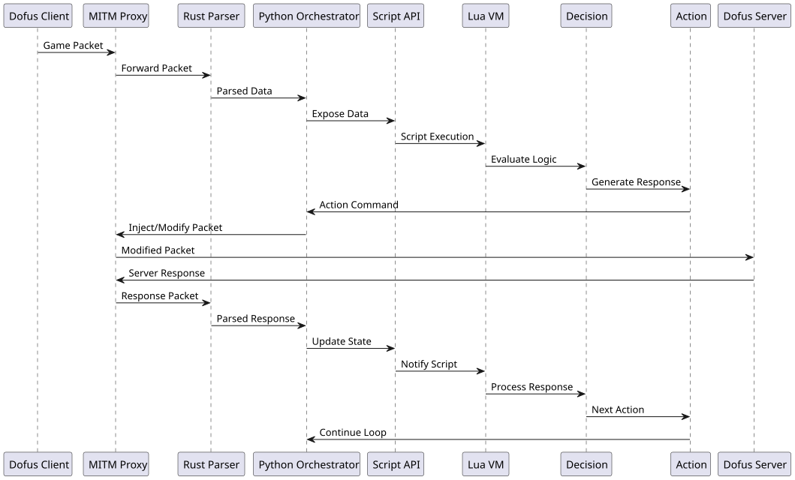
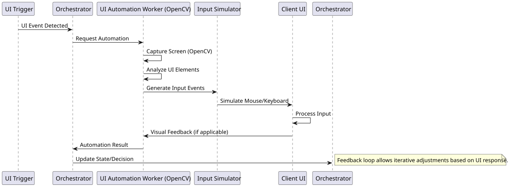
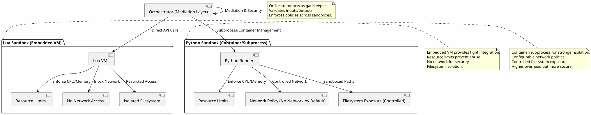

# Architecture Diagrams

## Component Diagram

*Alt-text: High-level component diagram showing Electron UI, FastAPI orchestrator, Rust core engine, MITM proxy, UI automation worker, Lua VM, Python sandbox, SQLite DB, scheduler, plugins, and system service with IPC channels and process boundaries.*

The component diagram illustrates the modular architecture of the Dofus bot system. The Electron UI provides the user interface, while the FastAPI orchestrator coordinates operations. The Rust core engine handles high-performance tasks like MITM parsing and scheduling. IPC channels use HTTP/gRPC/Unix sockets for communication. In-process components (e.g., Lua VM) offer efficiency, while out-of-process ones (e.g., MITM proxy) provide isolation. Permission elevation is required for network interception and input simulation.

## MITM Sequence Diagram

*Alt-text: Sequence diagram depicting packet flow from Dofus client through MITM proxy, Rust parser, Python orchestrator, script API, Lua VM, decision logic, action generation, back to proxy and server.*

This sequence shows the primary bot interaction path via MITM proxy. Packets are intercepted, parsed by Rust for performance, exposed to Python orchestrator, and processed by Lua scripts for decision-making. The design prioritizes low-latency parsing with Rust while leveraging Python's ecosystem for orchestration. Tradeoff: MITM requires network privileges but enables precise game state manipulation.

## UI Automation Sequence Diagram

*Alt-text: Sequence diagram for UI automation fallback: trigger to orchestrator, to OpenCV worker, input simulator, client UI, and feedback loop.*

The UI automation fallback uses OpenCV for visual analysis and input simulation when MITM is insufficient. This provides resilience against anti-cheat measures targeting network traffic. Rationale: Visual fallback ensures functionality even with encrypted or obfuscated protocols. Tradeoff: Higher latency and less reliable than MITM, but works with unmodified clients.

## Sandbox Flow Diagram

*Alt-text: Diagram showing Lua embedded VM and Python container sandboxes with resource limits, network policies, filesystem access, and orchestrator mediation.*

Sandboxing isolates user scripts for security. Lua uses an embedded VM for tight integration and low overhead, while Python employs containers/subprocesses for stronger isolation. Resource limits prevent abuse; network is blocked by default. The orchestrator mediates all sandbox interactions. Design choice: Lua for performance-critical scripts, Python for complex plugins. Tradeoff: Lua offers speed but weaker isolation; Python provides security at higher resource cost.